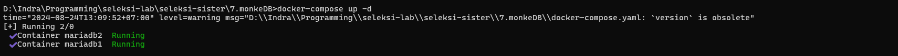
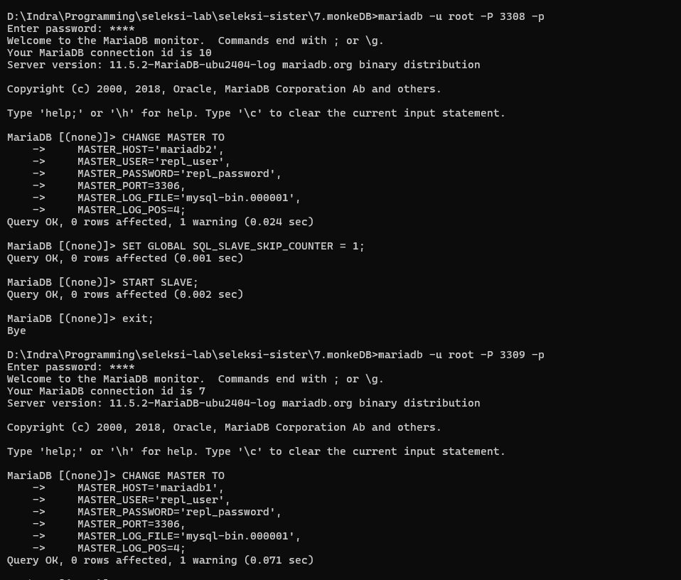
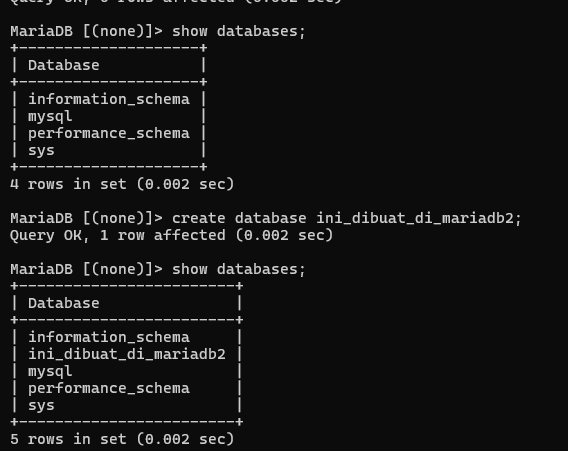
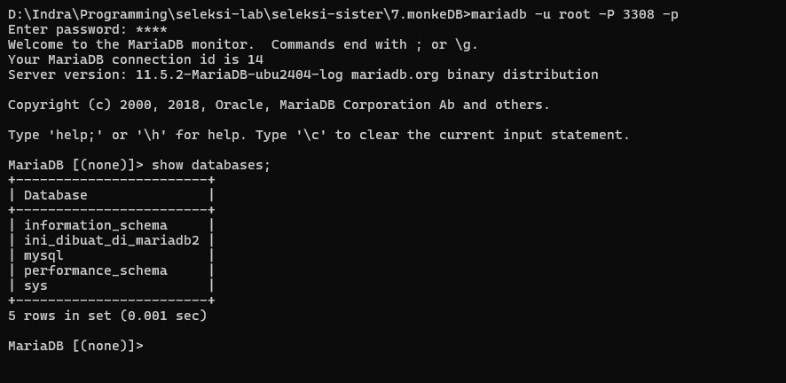
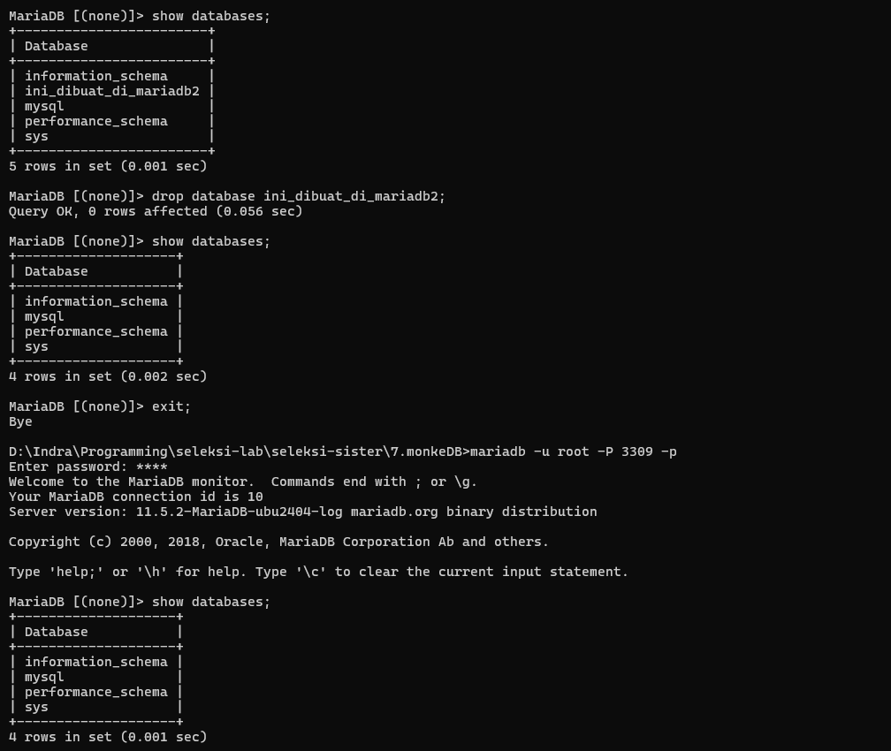
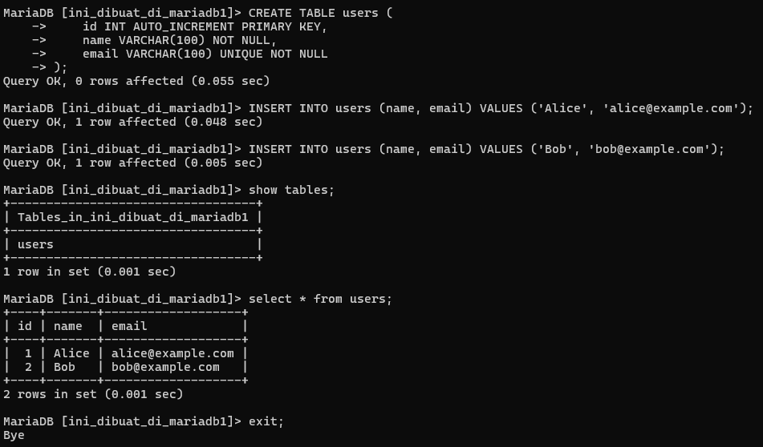
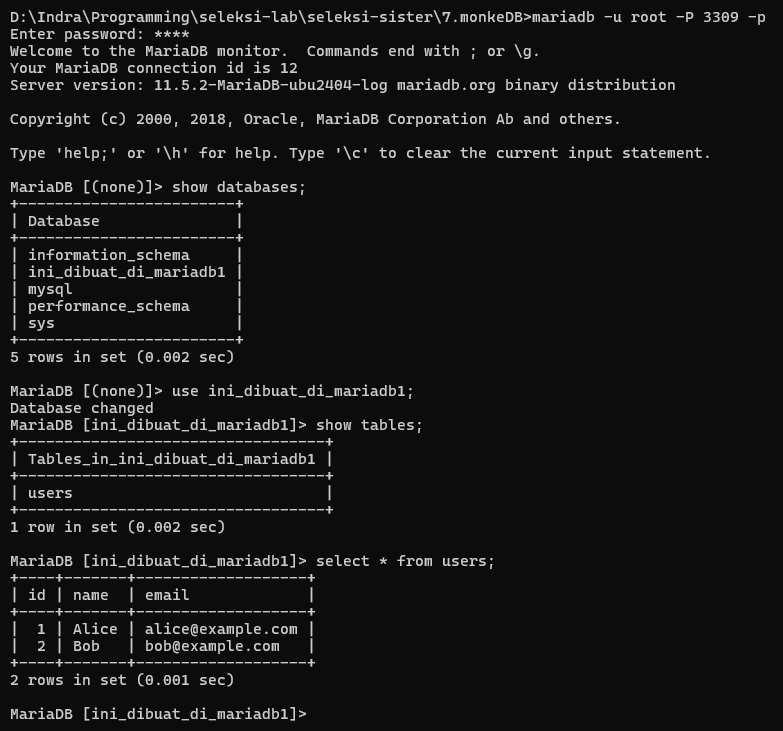

# MonyetDB 

yah, pada soal kali ini disuruh buat RDMS bidirection

## Script 
- docker-compose.yaml 
- command yang akan dijalankan pada masing-masing container 

berikut adalah docker-compose.yaml yang digunakan 
```yaml
version: '3.8'

services:
  mariadb1:
    image: mariadb:11.5 
    container_name: mariadb1 
    environment: 
      MARIADB_ROOT_PASSWORD: root
      MYSQL_ROOT_HOST: '%'
      MARIADB_REPLICATION_MODE: 'master'
      MARIADB_REPLICATION_USER: 'repl_user'
      MARIADB_REPLICATION_PASSWORD: 'repl_password'
    volumes: 
      - mariadb1_volume:/var/lib/mysql
    networks:
      - mariadb_network
    ports: 
      - 3308:3306
    command: --server-id=1 --log-bin=mysql-bin --binlog-format=MIXED

  mariadb2: 
    image: mariadb:11.5
    container_name: mariadb2
    environment: 
      MARIADB_ROOT_PASSWORD: root
      MYSQL_ROOT_HOST: '%'
      MARIADB_REPLICATION_MODE: 'master'
      MARIADB_REPLICATION_USER: 'repl_user'
      MARIADB_REPLICATION_PASSWORD: 'repl_password'
    volumes: 
      - mariadb2_volume:/var/lib/mysql
    networks:
      - mariadb_network
    ports: 
      - 3309:3306
    command: --server-id=2 --log-bin=mysql-bin --binlog-format=MIXED

volumes: 
  mariadb1_volume:
  mariadb2_volume:

networks: 
  mariadb_network:
```

## build container 
pastikan berada pada directory yang sama dimana docker-compose.yaml terletak 
lalu jalankan command 
```sh
docker-compose up -d 
```
jika sudah menjalankan perintah di atas pastikan muncul seperti gambar di bawah, ini menandakan databases dengan container mariadb1 dan mariadb2 dapat digunakan.


## Script pada container 
pertama kita gunakan container yang di-expose pada port 3308 
```sh
mariadb -u root -P 3308 -p
```
atau bisa juga menggunakan command ini 
```sh
docker exec -it mariadb1 mariadb -u root -p
```
- pass: root

copy command ini 
```sql 
CHANGE MASTER TO 
    MASTER_HOST='mariadb2', 
    MASTER_USER='repl_user', 
    MASTER_PASSWORD='repl_password', 
    MASTER_PORT=3306, 
    MASTER_LOG_FILE='mysql-bin.000001', 
    MASTER_LOG_POS=4;
SET GLOBAL SQL_SLAVE_SKIP_COUNTER = 1;
START SLAVE;
```

kita ke container yang di-expose pada port 3309 juga 
```sh 
mariadb -u root -P 3309 -p 
```
atau gunakan command ini 
```sh
docker exec -it mariadb2 mariadb -u root -p
```
- pass: root

copy command ini 
```sql
CHANGE MASTER TO 
    MASTER_HOST='mariadb1', 
    MASTER_USER='repl_user', 
    MASTER_PASSWORD='repl_password', 
    MASTER_PORT=3306, 
    MASTER_LOG_FILE='mysql-bin.000001', 
    MASTER_LOG_POS=4;

SET GLOBAL SQL_SLAVE_SKIP_COUNTER = 1;
START SLAVE;
```

# screenshot hasil 
port 3308: mariadb1
port 3309: mariadb2

## ini memasukkan command



## ini create database di mariadb2 



## ini hasilnya juga muncul di mariadb1 



## hapus database "ini_dibuat_di_mariadb2" di mariadb1 



## bikin database di mariadb1 dan membuat table di dalamnya 

