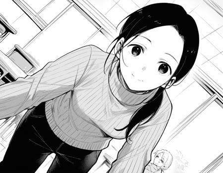
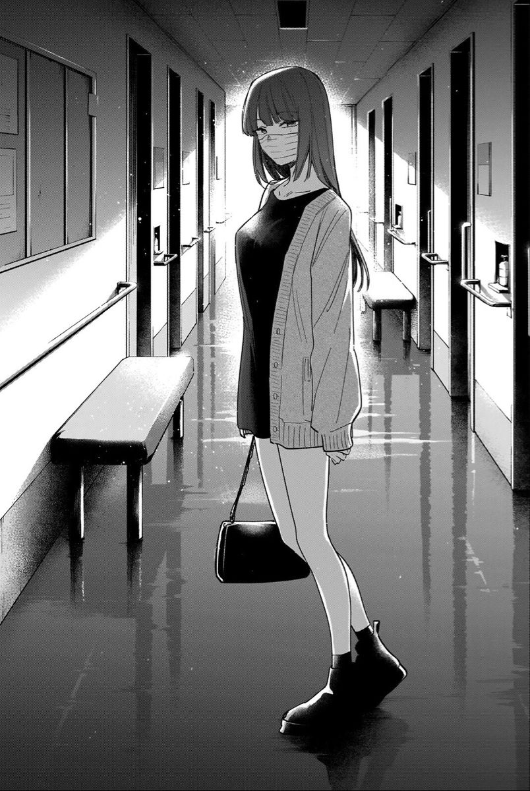

# seleksi-sister
nama: Indraswara Galih Jayanegara
NIM: 13522119

## mental support 
Mental-Mental Support gweh 

## Task completed
- [ ] 1. #AJEGILE 
- [X] 2. GNU-Linux: [doc](./2.GNU-Linux/GNU-Linux.pdf)
- [X] 3. Transister: [doc](./3.4bit/2nm%20Transister.pdf)
- [ ] 4. Cisco
- [X] 5. wolfman|Sigma
- [ ] 6. McLarren 
- [X] 7. MonkeDB: [doc](./7.monkeDB/README.md)
- [X] 8. Carpal Tunnel System: [doc](./8.Carpal/CARPAL-Dripping.pdf)
- [ ] 9. CTF: GUA SKILL ISSUE
- [X] 10. Sister.js: 
- [X] 11. Jancuk Pristail **INI SERU BANGET JIR ASLI!!!**
- [X] 12. Benchmarking: [doc](./12.benchmark/README.md)
- [X] 13. Fotosop: [doc](./13.Fotosop/README.md)
- [X] 14. I Am Dripping: [doc](./14.I-Am-Dripping/README.md)
- [X] 15. Pelabuhan: [doc](./15.pelabuhan/Pelabuhan.pdf)
- [ ] 16. BMI 
- [X] 17. klak-klak: [doc](./17.calc/README.md)
- [X] 18. TTKI: [doc](./18.TTKI/TTKI.pdf)

## Note
ada beberapa soal yang dikerjakan pada linux (ubuntu 24.04) dan windows 
### windows 
- 4bit 
- GNU-Linux 
- monkeDB 
- I-Am-Dripping 
- pelabuhan 
- TTKI (ya dokumen doang sih) 
- carpal (well, more like vm, tapi di cloud (azure))
### Ubuntu 
- sister.js 
- fotosop 
- benchmark 
- wolfman 
- calc

dipikir-pikir yang ngoding ngerjainnya di ubuntu semua lmao, yang teknikal ngerjain di windows wakakakakak
